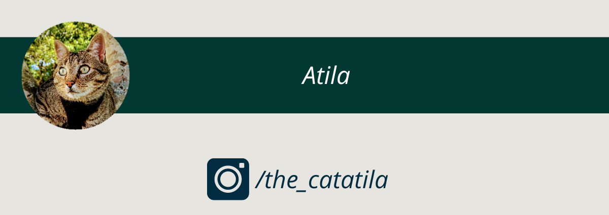
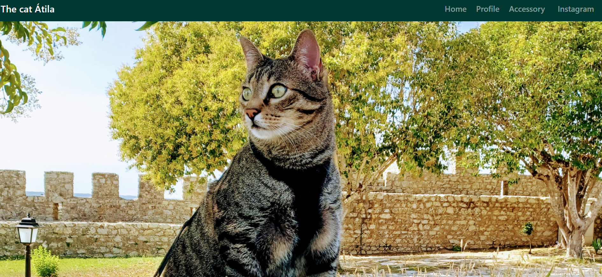

<h2 align='center'>Atila</h2>
 
This website was created to promote the Instagram page dedicated to my cat and aiming to promote animal welfare.

Furthermore, it was developed through a YouTube tutorial with the goal of deepening my knowledge in creating websites.

### Link

+ [Maiana Website](https://maiana.netlify.app/)



### What's included

Within the download of this repository, you'll find the following directories and files:

```
Atila_Website/
├── assets/
|   ├── css/
|   |   ├── app.css
|   |   └── bootstrap.css
|   ├── fontawesome/
|   |   ├── css/
|   |   └── webfonts/
|   ├── img/
|   └── js/
|
└── index.html

 ```
 [](https://app.netlify.com/sites/maiana/deploys)

### Tools

+ images: amazon.com
+ Bootstrap
+ Css
+ Fontawesome
+ Html
+ Javascript 
